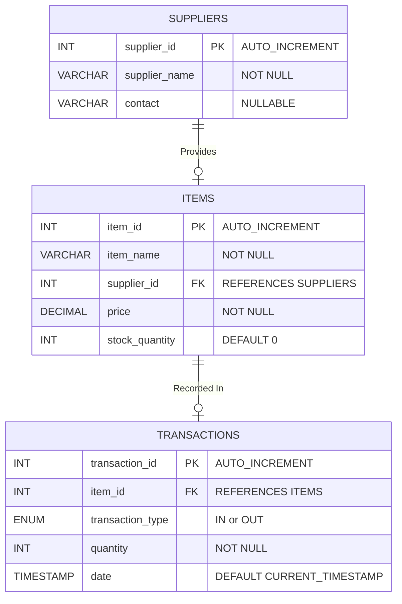
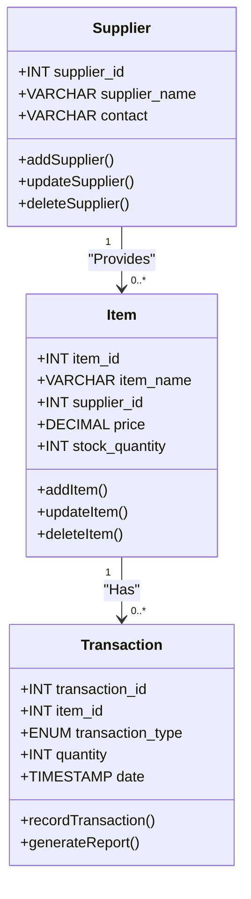

# Inventory System

Built using PHP and MySQL

## ERD

ERD visually represents the database structure, including relationships and cardinalities.

---

## Data Dictionary

The data dictionary provides a detailed description of the tables, fields, and constraints.

### **Table: `suppliers`**
| Field Name     | Data Type       | Constraints           | Description                     |
|----------------|-----------------|-----------------------|---------------------------------|
| `supplier_id`  | INT             | PRIMARY KEY, AUTO_INCREMENT | Unique supplier identifier      |
| `supplier_name`| VARCHAR(100)    | NOT NULL              | Supplier's name                 |
| `contact`      | VARCHAR(50)     | NULLABLE              | Supplier's contact information  |

### **Table: `items`**
| Field Name        | Data Type       | Constraints                 | Description                       |
|-------------------|-----------------|-----------------------------|-----------------------------------|
| `item_id`         | INT             | PRIMARY KEY, AUTO_INCREMENT | Unique item identifier            |
| `item_name`       | VARCHAR(100)    | NOT NULL                    | Name of the item                  |
| `supplier_id`     | INT             | FOREIGN KEY REFERENCES `suppliers(supplier_id)` | Supplier providing the item       |
| `price`           | DECIMAL(10,2)   | NOT NULL                    | Price per item                    |
| `stock_quantity`  | INT             | DEFAULT 0                   | Quantity of stock available       |

### **Table: `transactions`**
| Field Name         | Data Type       | Constraints                 | Description                       |
|--------------------|-----------------|-----------------------------|-----------------------------------|
| `transaction_id`   | INT             | PRIMARY KEY, AUTO_INCREMENT | Unique transaction identifier     |
| `item_id`          | INT             | FOREIGN KEY REFERENCES `items(item_id)` | Item involved in the transaction  |
| `transaction_type` | ENUM('IN','OUT')| NOT NULL                    | Type of transaction: IN or OUT    |
| `quantity`         | INT             | NOT NULL                    | Quantity moved in transaction     |
| `date`             | TIMESTAMP       | DEFAULT CURRENT_TIMESTAMP   | Date and time of transaction      |

---

## Class Diagram

The Class Diagram describes the system's structure in object-oriented form. 

---

## Install and Use

1. Requirements

- XAMPP
- PHP
- Composer
- Git
- Bootstrap CSS

2. Database
    2.1 Run XAMPP SQL/Apache Servers
    2.2 Go to `localhost/phpmyadmin`
    2.3 Create a database `inventory_system`
        2.1.1. Run the script:

            CREATE DATABASE IF NOT EXISTS inventory_system;
            USE inventory_system;
            CREATE TABLE suppliers (
                upplier_id INT AUTO_INCREMENT PRIMARY KEY,
                supplier_name VARCHAR(100) NOT NULL,
                contact VARCHAR(50)
            );
            CREATE TABLE items (
                item_id INT AUTO_INCREMENT PRIMARY KEY,
                item_name VARCHAR(100) NOT NULL,
                supplier_id INT,
                price DECIMAL(10,2) NOT NULL,
                stock_quantity INT DEFAULT 0,
                FOREIGN KEY (supplier_id) REFERENCES suppliers(supplier_id)
                    ON DELETE SET NULL
            );
            CREATE TABLE transactions (
                transaction_id INT AUTO_INCREMENT PRIMARY KEY,
                item_id INT,
                transaction_type ENUM('IN', 'OUT') NOT NULL,
                quantity INT NOT NULL,
                date TIMESTAMP DEFAULT CURRENT_TIMESTAMP,
                FOREIGN KEY (item_id) REFERENCES items(item_id)
                ON DELETE CASCADE
            );

   INSERT SAMPLE DATA (Optional)

            INSERT INTO suppliers (supplier_name, contact) VALUES
                ('Tech Supplies Co.', 'techsupplies@example.com'),
                ('Hardware Hub', 'hardwarehub@example.com'),
                ('Gadget World', 'gadgetworld@example.com');
            INSERT INTO items (item_name, supplier_id, price, stock_quantity) VALUES
                ('USB Cable', 1, 2.50, 100),
                ('Wireless Mouse', 2, 15.00, 50),
                ('HDMI Cable', 1, 5.00, 75),
                ('Laptop Stand', 2, 25.00, 30),
                ('Power Bank', 3, 20.00, 40);
            INSERT INTO transactions (item_id, transaction_type, quantity, date) VALUES
                (1, 'IN', 50, '2024-12-01 10:00:00'),
                (1, 'OUT', 20, '2024-12-02 15:30:00'),
                (2, 'IN', 30, '2024-12-03 09:45:00'),
                (3, 'OUT', 10, '2024-12-04 13:20:00'),
                (4, 'IN', 20, '2024-12-05 14:10:00'),
                (5, 'OUT', 5, '2024-12-06 11:15:00');

4. Navigate to `C:/xampp/htdocs`

6. Open a shell (e.g. Powershell, Bash) then run

            composer require tecnickcom/tcpdf
            git clone https://github.com/wukinnin/inventory_system
            git checkout main

8. Navigate to `localhost/inventory_system/index.php`
